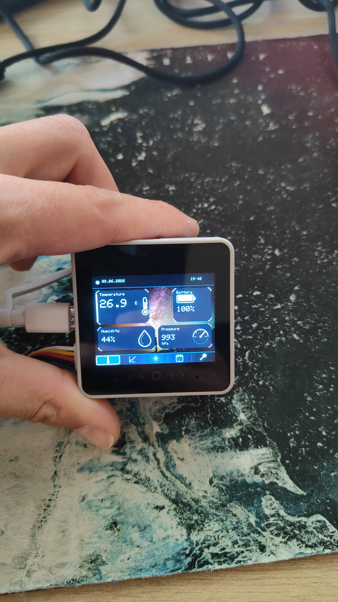
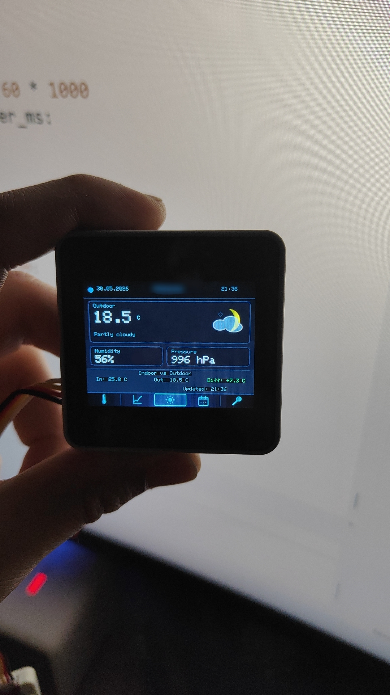
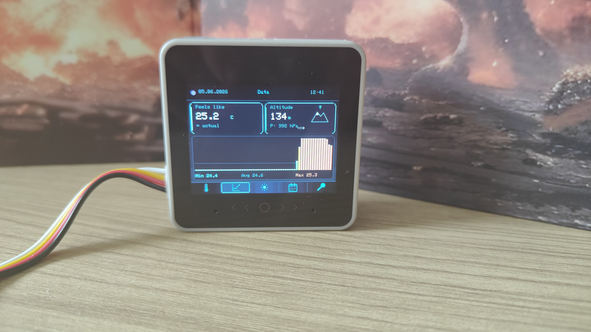
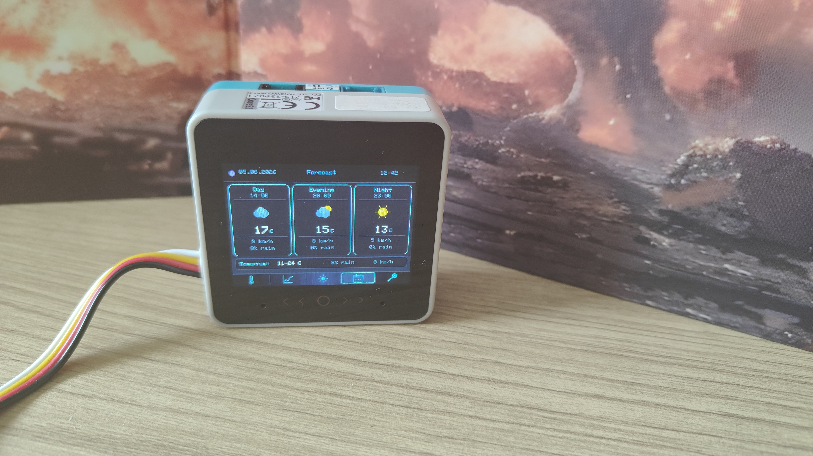
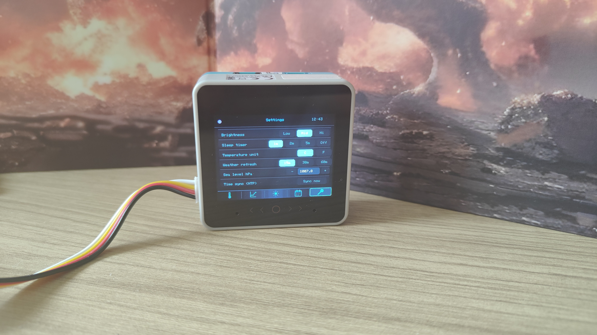

# MeteoStation

An embedded weather station built on **M5Stack CoreS3 SE** (ESP32-S3), written in pure MicroPython. Measures indoor temperature, humidity, and atmospheric pressure via an ENV III sensor, fetches outdoor weather forecasts from the Open-Meteo API over WiFi, and displays everything across five navigable screens on a 2.0" touchscreen.

---
!
!
!
!
!
## Features

- **Five screens** — Main, Data, Weather, Forecast, Settings — navigated via a PNG icon nav bar
- **Local measurements** — temperature, humidity, and pressure polled every 5 seconds via I2C
- **Derived metrics** — heat index (feels-like), barometric altitude, and pressure trend (rising/stable/falling)
- **Outdoor weather** — current conditions, hourly forecast, and tomorrow's outlook via Open-Meteo (no API key required)
- **3-day weather history** — min/max temperature, precipitation category, and wind speed from Open-Meteo Archive API
- **Weather cache** — last known weather is stored on flash and shown immediately at boot, before WiFi connects (stale-while-revalidate pattern)
- **Archive cache** — historical data cached by date; refreshes once per day, not on every boot
- **Stale data indicator** — amber highlight when cached data is older than 6 hours
- **WiFi configuration on-device** — scan networks, select SSID, and enter password directly on the touchscreen — no JSON editing required
- **On-screen keyboard** — full QWERTY + numeric/symbol layout with 3-state caps lock (lowercase / one-shot uppercase / CAPS LOCK), password progress bar, show/hide toggle
- **Async architecture** — `asyncio`-based event loop; WiFi refresh runs as a background task so touch and sensors stay responsive during network operations
- **Retry logic** — automatic retry after 5 minutes if a weather fetch fails, up to 3 attempts
- **Sleep mode** — screen blanks after configurable idle timeout, wakes on touch
- **NTP time sync** — at boot and every 24 hours
- **BMP background image** — custom 320×240 RGB565 bitmap displayed behind the main screen cards
- **Persistent settings** — brightness, sleep timer, temperature units, and weather refresh interval saved to flash

---

## Hardware

| Component | Notes |
|---|---|
| M5Stack CoreS3 SE | ESP32-S3, 2.0" IPS 320×240 touch display |
| ENV III Unit | SHT30 (temp/humidity) + QMP6988 (pressure), Grove I2C |
| M5GO Battery Bottom 3 | 500 mAh, attaches via pogo pins |

The ENV III sensor connects to **Grove Port A** (SCL = GPIO 1, SDA = GPIO 2). Remove the orange protective film from the CoreS3 SE pogo pins before attaching the battery bottom.

---

## Prerequisites

Before installing, you need two things on your computer.

**Thonny IDE** is used to upload files to the device and interact with the MicroPython REPL. Download it from [thonny.org](https://thonny.org).

**UIFlow2 firmware** must be flashed onto the CoreS3 SE. Use [M5Burner](https://docs.m5stack.com/en/download) to flash the latest UIFlow2 image. In the boot configuration, select **"Run main.py directly"** so the station starts automatically on power-up.

---

## Installation

**Step 1 — Clone the repository:**
```bash
git clone https://github.com/navarrerock/MeteoStation.git
cd MeteoStation
```

**Step 2 — Create your config file:**

Copy the example config and fill in your details:
```bash
cp config.example.json config.json
```

Open `config.json` and set at minimum `wifi_ssid`, `wifi_pass`, `weather_lat`, `weather_lon`, and `weather_city`. Coordinates for your location can be found on [open-meteo.com](https://open-meteo.com).
> **Note:** Starting from v1.5, WiFi credentials can also be configured directly on the device via Settings → Connectivity → WiFi. No manual JSON editing required for WiFi setup.
**Step 3 — Create the icon folders on the device:**

Connect the device in Thonny and run in the REPL:
```python
import os
os.mkdir('/flash/icons')
os.mkdir('/flash/icons/ui')
os.mkdir('/flash/cache')
os.mkdir('/flash/bg')
```

**Step 4 — Upload files via Thonny:**

In Thonny's file manager, upload the following to `/flash/` on the device:

```
main.py
wcache.py
icomod.py
config.json
icons/          ← weather PNG icons (18 files)
icons/ui/       ← UI icons (nav bar, cards, status)
bg/
└── bg_stars.bmp   ← background image for main screen
```

**Step 5 — Reboot the device.** After the RGB LED animation, the main screen appears with local sensor data. Weather data loads as soon as WiFi connects.

---
## WiFi Configuration

WiFi can be configured two ways:

**Option A — On-device (recommended):** Navigate to Settings → Connectivity → WiFi. Tap **Scan** to discover nearby networks, select your SSID, enter the password using the on-screen keyboard, and tap **OK**. Credentials are saved to `config.json` automatically on successful connection.

**Option B — Manual:** Edit `config.json` directly in Thonny and set `wifi_ssid` and `wifi_pass` before uploading.

---

## Background Image

The main screen supports a custom 320×240 background image. A sample starfield image (`bg/bg_stars.bmp`) is included in the repository.

To use your own image, convert it to BMP RGB565 format using the following Python script:

```python
from PIL import Image, ImageEnhance
import struct, os

img = Image.open("your_photo.jpg")

# crop to 320x240 preserving aspect ratio
src_w, src_h = img.size
if (src_w / src_h) > (320 / 240):
    new_w = int(src_h * 320 / 240)
    left = (src_w - new_w) // 2
    img = img.crop((left, 0, left + new_w, src_h))
else:
    new_h = int(src_w * 240 / 320)
    top = (src_h - new_h) // 2
    img = img.crop((0, top, src_w, top + new_h))

img = img.resize((320, 240))
img = ImageEnhance.Brightness(img).enhance(0.35)  # 65% darkening
img = img.convert("RGB")

data_size = 320 * 240 * 2
with open("bg_stars.bmp", "wb") as f:
    f.write(b'BM')
    f.write(struct.pack('<I', 54 + 12 + data_size))
    f.write(b'\x00\x00\x00\x00')
    f.write(struct.pack('<I', 66))
    f.write(struct.pack('<I', 40))
    f.write(struct.pack('<i', 320))
    f.write(struct.pack('<i', -240))
    f.write(struct.pack('<H', 1))
    f.write(struct.pack('<H', 16))
    f.write(struct.pack('<I', 3))
    f.write(struct.pack('<I', data_size))
    f.write(struct.pack('<i', 2835))
    f.write(struct.pack('<i', 2835))
    f.write(struct.pack('<I', 0))
    f.write(struct.pack('<I', 0))
    f.write(struct.pack('<I', 0xF800))
    f.write(struct.pack('<I', 0x07E0))
    f.write(struct.pack('<I', 0x001F))
    for r, g, b in img.getdata():
        rgb565 = ((r & 0xF8) << 8) | ((g & 0xFC) << 3) | (b >> 3)
        f.write(struct.pack('<H', rgb565))
```

Upload the resulting `bg_stars.bmp` to `/flash/bg/bg_stars.bmp` on the device.

> **Tip:** Dark images with brightness around 30–40% work best — text and card borders remain readable against the background.

## Configuration

All settings live in `/flash/config.json`. The file is created from defaults on first run if it does not exist, so the device will start without WiFi if no config is present — it will display sensor data and show cached weather if available.

| Key | Type | Default | Description |
|---|---|---|---|
| `wifi_ssid` | string | `""` | WiFi network name |
| `wifi_pass` | string | `""` | WiFi password |
| `weather_lat` | float | `0.0` | Latitude of your location |
| `weather_lon` | float | `0.0` | Longitude of your location |
| `weather_city` | string | `"City"` | City name shown in the top bar |
| `utc_offset` | int | `0` | UTC offset in hours |
| `brightness` | int | `120` | Backlight level (40 / 120 / 220) |
| `sleep_min` | int | `2` | Minutes before sleep (0 = disabled) |
| `temp_unit` | string | `"C"` | Temperature unit (`C` or `F`) |
| `sea_level_hpa` | float | `1013.25` | Sea-level pressure for altitude calibration |
| `weather_refresh_min` | int | `30` | Weather update interval in minutes |

Settings can also be changed at runtime on the **Settings screen** and are written to flash immediately.

### Altitude calibration

The `sea_level_hpa` value is *not* your current atmospheric pressure — it is the pressure reduced to sea level, which is always higher than the local reading. Adjust it in Settings (± 0.5 hPa steps) until the altitude shown on the Data screen matches the known elevation of your location.

---

## File Structure

```
/flash/
├── main.py              # Core application: screens, event loop, sensors, weather
├── wcache.py            # Weather + archive cache module
├── icomod.py            # Icon module: WMO code → PNG filename mapping
├── config.json          # Your settings (not in repo — see config.example.json)
├── bg/
│   └── bg_stars.bmp     # Background image for main screen (320×240 RGB565)
├── icons/               # Weather PNG icons, 64×64, transparent background
│   ├── clear_day.png
│   ├── rain.png
│   └── ...              # 18 icons total
├── icons/ui/            # UI icons: nav bar (24×24), cards, status (16×16)
│   ├── thermometer.png
│   ├── humidity.png
│   ├── pressure.png
│   ├── altitude_48.png
│   ├── battery_shell.png
│   └── ...
└── cache/               # Created automatically on first fetch
    ├── weather.json     # Cached forecast (~2 KB)
    └── archive.json     # Cached 3-day history (date-keyed)
```


The `/flash/cache/` directory is created automatically on first successful weather fetch and stores `weather.json` (~2 KB).

---

## Technical Notes

**Why `asyncio`?** The WiFi connection and HTTP fetch can block for several seconds. By running the weather refresh as a separate `asyncio` task (`wifi_loop`), the main loop continues processing touch input and updating sensors while the network operates in the background. The key insight is that `await asyncio.sleep()` yields execution to other tasks, whereas `time.sleep()` would freeze the entire device.

**Why a weather cache?** The stale-while-revalidate pattern means the device always has something useful to show. On boot, the last known weather appears instantly from flash before any network activity. WiFi then fetches fresh data and updates the display — the user never sees empty cards.

**Why a separate archive cache?** Historical data for past days never changes after midnight, so caching it by date (not by age) avoids unnecessary API calls. The archive is fetched once per day and reused for all subsequent boots on the same date.

**Icon rendering** uses `canvas.drawImage(path, x, y)` on an off-screen canvas buffer. Drawing every element — including PNG icons — onto the canvas *before* `canvas.push()` ensures the display is updated in a single atomic operation, eliminating flicker.

**BMP background performance:** The 320×240 RGB565 BMP file (~150 KB) is read directly from flash into the display buffer without full RAM allocation, making it practical even on devices with limited SRAM.
---

## Roadmap

- [x] Open-Meteo Archive API for 3-day outdoor weather history
- [x] WiFi configuration from the device screen
- [x] Custom background image support
- [ ] Port to C++ / ESP-IDF for full M5GFX alpha blending support
